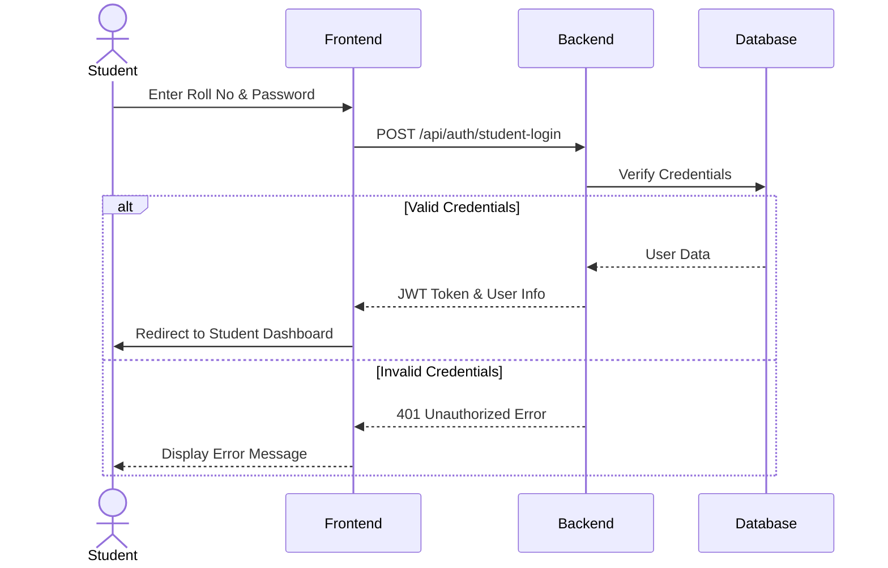
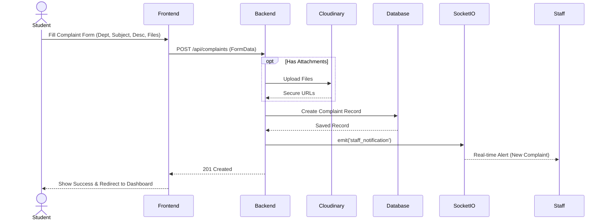
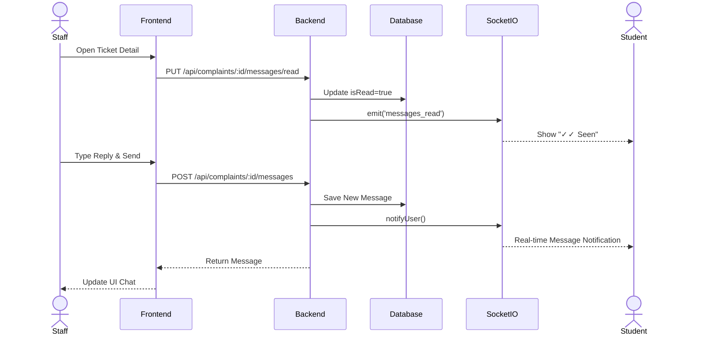
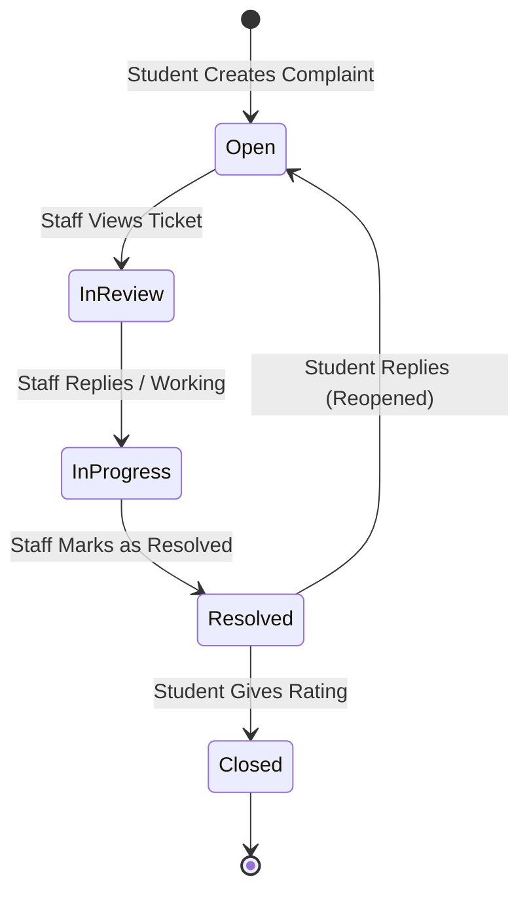

# Complaint Portal Workflow

## 1. Student Authentication Workflow
The process begins when a student accesses the portal to seek assistance.

## 2. Complaint Creation Workflow
Once logged in, the student can create a new complaint.

## 3. Staff Review & Reply Workflow
Staff members receive the complaint and interact with the student.

## 4. End-to-End Complaint Lifecycle

